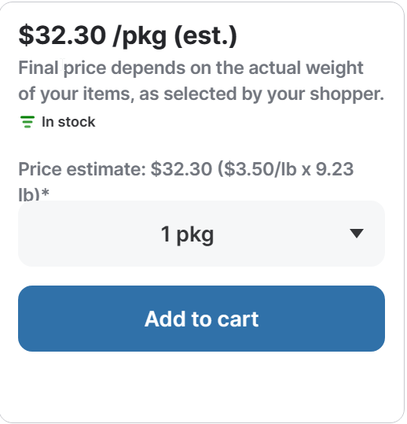
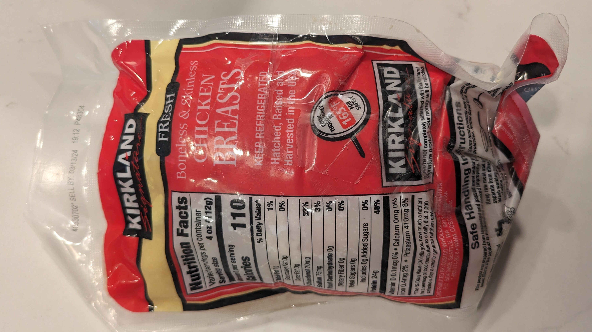
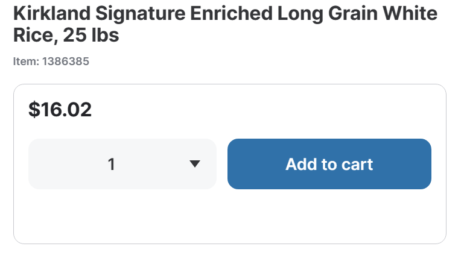
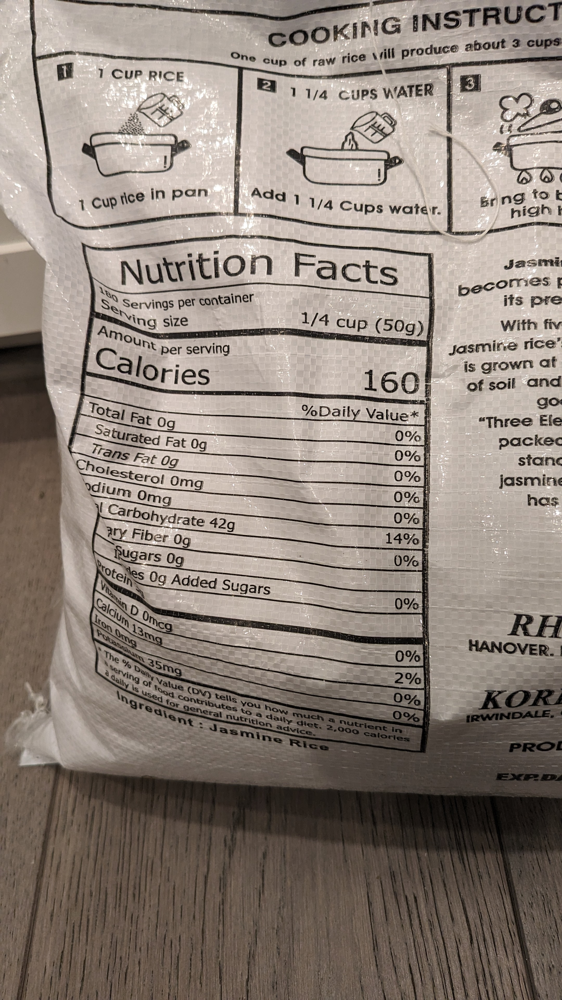
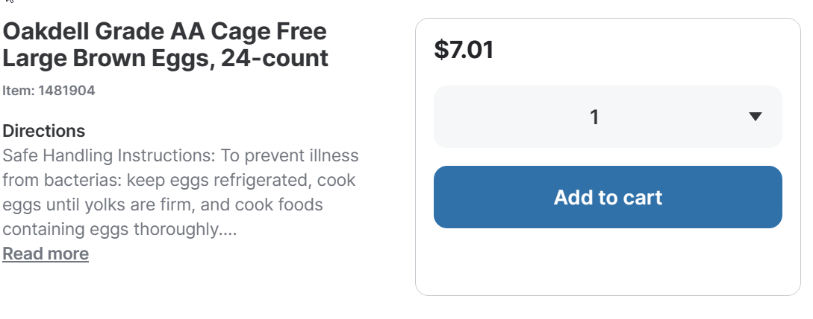
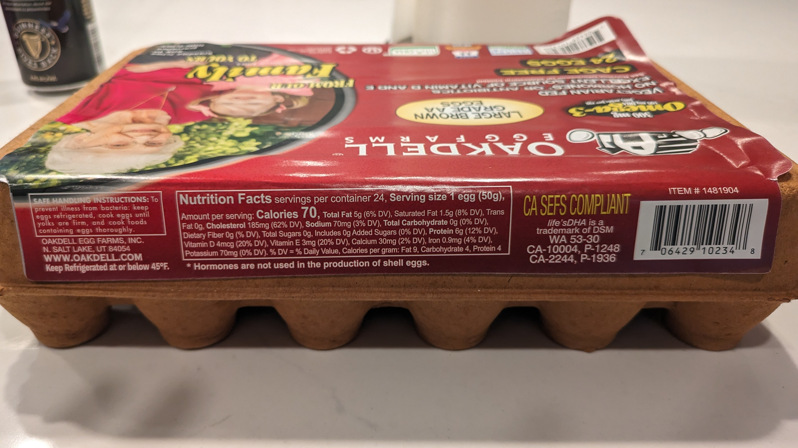
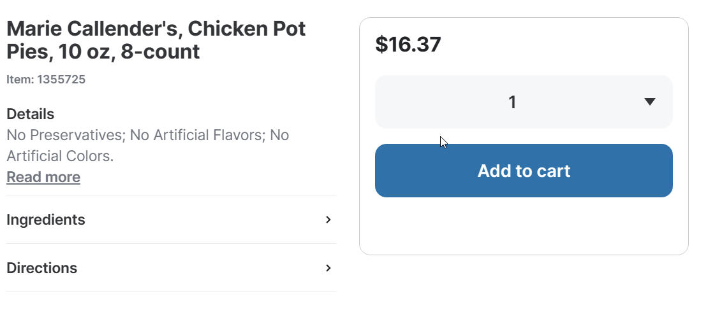
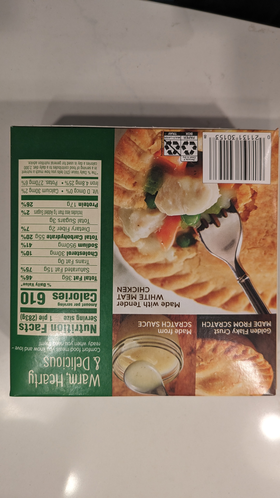
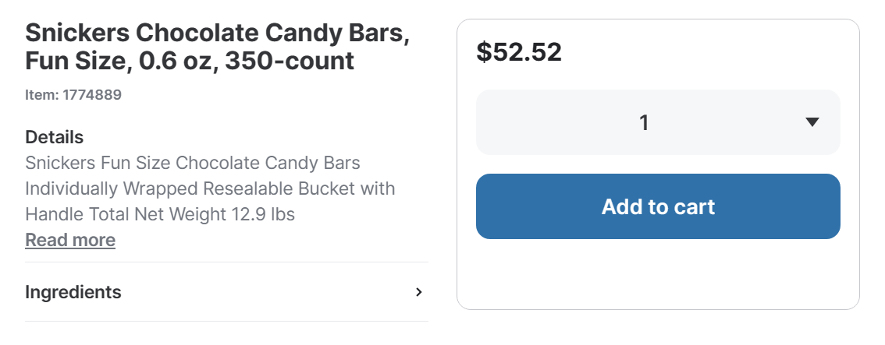
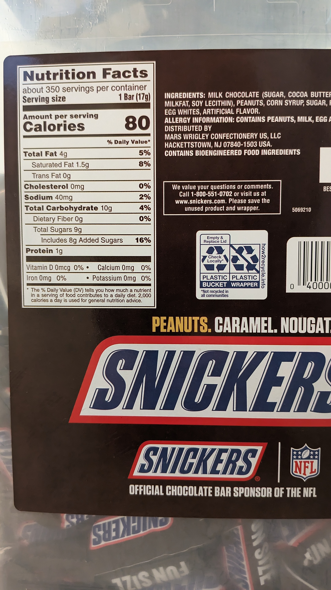

# Assignment 1: The Diet Problem Revisited
[Link to pdf](./a1.pdf)

### Item Overview (per serving)
|Variable | Item            | Price | Sodium | Energy | Protein | Vitamin D | Calcium | Iron | Potassium |
|---------|-----------------|-------|--------|--------|---------|-----------|---------|------|-----------|
|x1       | Chicken + Rice  |$2.838 |225mg   |810cal  |72g      |0.3mcg     |39mg     |1.2mg |1335mg     |
|x2       | Eggs            |$0.292 |70mg    |70cal   |6g       |4mcg       |30mg     |0.9mg |70mg       |
|x3       | Chicken Pot Pie |$2.046 |950mg   |610cal  |17g      |0mcg       |30mg     |4.8mg |270mg      |
|x4       | Snickers        |$0.150 |40mg    |80cal   |1g       |0mcg       |0mg      |0mg   |0mg        |
|x5       | Waffles         |$0.386 |410mg   |195cal  |4.6g     |0mcg       |260mg    |3.6mg |50mg       |
|         | Chicken         |$0.875 |75mg    |110cal  |24g      |0.1mcg     |0mg      |0.4mg |410mg      |
|         | Rice            |$0.071 |0mg     |160cal  |0g       |0mcg       |13mg     |0mg   |35mg       |

#### Chicken and Rice (Meal)
For this meal I typically have about 12oz of chickent (3 servings) and 3/4 cup of rice (3 servings)

##### Chicken

###### Price Calculation
$\$3.50/lb = \$3.50/16oz$
$\$0.875/4oz$

##### Rice

###### Price Calculation
**NOTE:** I have a 20lb bag of rice so there was a bit of a conversion for price compared to the costco one.

Let x be the price of the 20lb bag
$25/16.02 = 20/x$
$25x = 320.40$
$x = 12.816$

Calculate price per serving
$\$12.816/180=.071$

#### Egg

###### Price Calculation
$\$7.01 / 24 = \$0.292$

#### Chicken Pot Pie

###### Price Calculation
$\$16.37 / 8 = \$2.046$

#### Snickers

###### Price Calculation
$\$52.52 / 350 = \$0.150$

#### Waffles

I threw away the box so I had to get the nutritional information online.
###### Price Calculation
$\$13.89 / 36 = \$0.386$

#### Results
[Results from 0 minimum](./solution.txt)
[Results from 1 minimum](./solution2.txt)